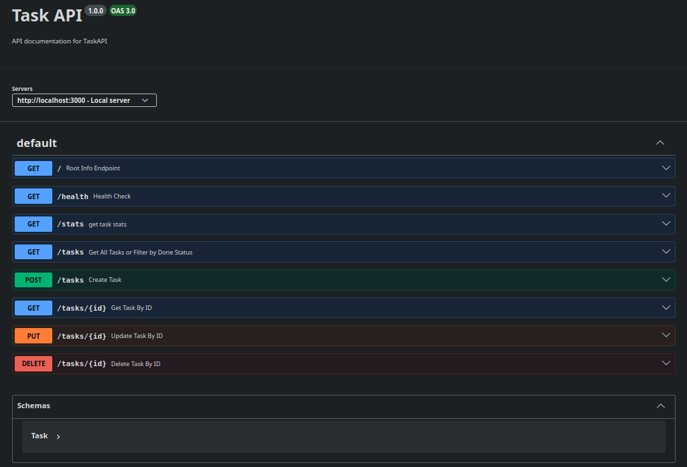

# CRUD EXPRESS
A to-do list that manage data from memory. It involves the creation, deletion, filtering, update and getting the task status/statistics. Check endpoint `/docs` to read all the request of this API using `swagger-ui-express`.

## Note to the Evaluator
I compile all of my tasks in this repository, you can check each history through its designated branches named after
the task week, act number, and my current course : `W1A1BE`.

## How to run
* install dependencies using : `npm install`
* run using : `npm run dev`

## Table of all Enpoints

| Method | Endpoint  | Description                                                                                                         |
|--------|-----------|---------------------------------------------------------------------------------------------------------------------|
| GET    | /         | Details about the API                                                                                               |
| GET    | /health   | Is the API successfully running?                                                                                    |
| GET    | /task/:id | Find task via ID                                                                                                    |
| GET    | /task     | get all the task, you can also retrieve  an object filtered out by `title`and `done`                             |
| POST   | /task     | Create a task, given a .json of `{title, done}` Auto incremented ID based of the total length  of the dataset |
| PUT    | /task/:id | Update a record given the parameter id.  pass a .json with `title` and/or `done` status.                         |
| DELETE | /task/:id | Delete a task given the id parameter                                                                                |
| GET    | /stats    | Returns the status of the to-do list, `{total, done, open}`                                                         |

## TRY IT!
* Using curl : `curl -i -X POST http://localhost:3000/tasks -H "Content-Type: application/json" -d '{"title":"Buy milk"}'`

## Swagger UI
End point `/docs`  

